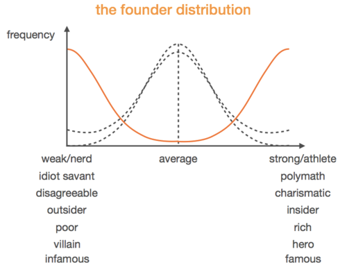
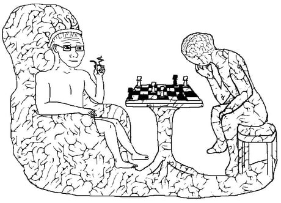
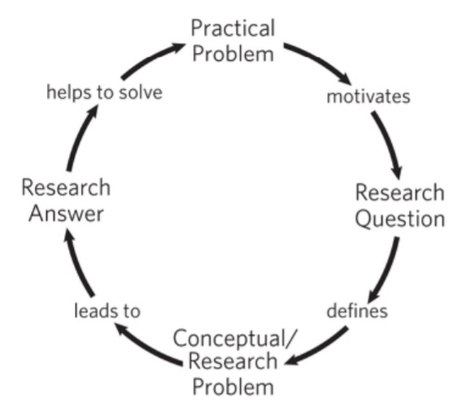
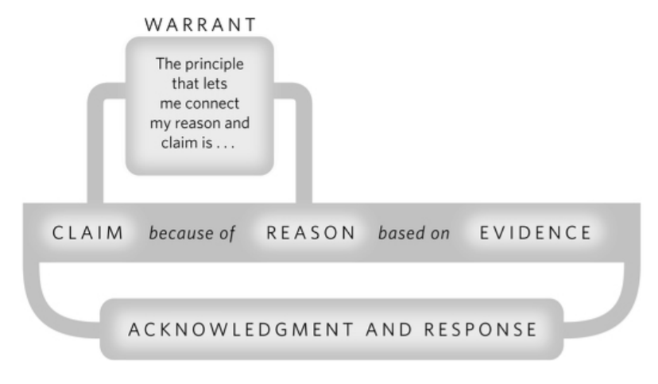

This post is to collect summaries and key takeaways from the books I read. All summaries range from mostly to totally positive.
This is because I only summarized books I've read in their entirety.
If I didn't like a book I would have stopped reading it.
I've kept track of every book since 2019, and often read a couple books at a time.

{:.no_toc}

* A markdown unordered list which will be replaced with the ToC, excluding the "Contents header" from above
{:toc}

# The Culture Code - Daniel Coyle

> Why do some groups come together and add up to be greater than the sum of its parts?

If I were to ask you who could do linear algebra better: a group of kinder-gardeners or a group of MBA students, you would likely pick the latter.
How about something simpler: build a tower with nothing but spaghetti, tape, string, and a marshmallow.
In this regard, the kinder-gardeners triumph.
Why?
This is the question that "The Culture Code" exists to answer.
Culture, no matter the type or scale, is essential to every choice, action, and thought one has.
This is because none is made without culture in mind, yet all of them ultimately influence culture itself.

## Key Takeaways

 - The psychological effects of just a handfull of words and the way those words are delivered is overwhelmingly powerful. To ask a stranger at the bus station on a rainy day "Can I borrow your phone?" versus "I'm so sorry about the rain, can I borrow your phone" is the difference between a 422% increase in response rate. 6 words = 4x as likely to get what you want. Unreal.
 - No one knows his name, but Jeff Dean made Google the giant that it is today. He is the reason why when you search Kawasaki H1B motorcycle on Google AdWords, you get the motorcycle and not a H-1B foreign visa application. Jeff did this, not because it was his job to, but because he was so in tune with what Google stood for, he took it upon himself to work on a problem that wasn't even his department. When confronted about his solution, he said "It didn't feel special or different. It was normal. That kind of thing happened all the time."
 - In the event of a catastrophic failure (the official term the National Transporation Safety Board used for United Airlines Flight 232) the words you use are a matter of life or death. Pilots use what is known as notifications; maximize information, vulnerability, and openness with as little words as possible. 
 - Tony Hsieh, the eccentric founder of LinkExchange (sold to Microsoft) and Zappos (sold to Amazon), has a unique take of building culture and making new friends; he is notorious for mediating warm introductions between new people he meets and people he already knows. Basically leveraging arguably the most valuable resource; human resources.
 - Pixar saved Disney from making any more animated movie atrocities. They did this with more than just creativity. Pixar's "Inside Out", "Nemo", and "Monster's Inc,", literally taught Disney how to make "Frozen", "Big Hero 6", and "Zootopia". When Disney acquired Pixar, they acquired more than just creativity; they acquired Pixar's community and culture of communication, bar-setting, and vulnerability.
 
 - The coaches of top basketball teams, high ranking officers of the Navy SEALs, and owners of some of the best restaurants in the world (11 Madison Park and Shake Shack) all have something in common. The pre and post. Each highly successful group has a different name for them, but simply put, what happens before and after a big game, a dangerous operation, or a busy Friday dinner service, is key to community growth.

# The Talent Code - Daniel Coyle
## Key Takeaways

# Zero to One - Peter Thiel

> How do you build an impactful, sustainable, profitable, and successful startup; how do you go from 0 to 1?

Peter Thiel is the "veteran of a hundred battles" of the startup world.
Best known for PayPall, Thiel started more than just a company; his story influenced the very culture, methods, and ideas that are central to startups.
Just look at the "PayPall Mafia", a group of individuals who, after leaving PayPall, went on to start more highly impactful companies, analogous to the way the splitting of an atom causes a domino effect.

Peter Thiel takes common misconceptions about startups and shreds them apart, whilst revealing the truth behind the secrets of any successful startup.
Drawing from both his own experiences and observations, he details everything from the economics to the operations, from the market to the team, and covers all corners.
It's like a cheatsheet for founders, entrepreneurs, and techies.

## Key Takeaways

 - For good companies are great - when done correctly. In the first decade of the 2000s, there was a boom in green-tech/ clean-tech startups. Almost all of them, save for Tesla and a handful of others, survived.
 - PayPal and X.com (an online banking company built by Elon Musk) put aside their competition to survive the dot-com crash; a move that saved them both in a crash that took down hundreds of companies.
 - There is a reason why most successful co-founders are shut-ins. The population can be represented by a normal distribution (black line)
{:class="img-responsive"}

this normal distribution is universal. What makes founders, entrepreneurs, and tech nerds so different? It turns out, they are exactly the opposite (orange line). They are polarizing to the point of irony. Name any notable founder and they belong in one of the extremes. 

# Brief Andwers to the Big Questions - Stephen Hawking
Is there a God? How did it all begin? Is there extraterrestrial intelligent life? Can we predict the future? What is inside a black hole? Is time travel possible? Will we survive on Earth? Should we colonize space? Will A.I outsmart us? How do we shape the future?

In honor of the late and forever great Stephen Hawking, BABQ was a book I had to read.
Hawking's final work focuses on the final 10 questions he was striving to answer.
I found myself gazing up at the sky more often this month than even before in my life, even as a child.
It fascinating to read about the history of the universe in a style reminiscent of  "Sapiens", only this time, from the perspective of a world renowned physicist.
This book made me realize how unfortunate it is that most people hear the voices of less intelligent people more often than the smartest people.
It made me think and realize that the smart people tend to be careful when making statements; they are experts at discerning fact from fiction or hypothesis.
One can then infer that we should be paying attention to any statements smart people say. Today, this fact cannot be understated.

This book, regardless of your background, beliefs, or knowledge, is a must read.
You will finish it feeling enlightened, inspired, and best of all, optimistic.
May he rest in piece, next to the ashes of Sir Isaac Newton and Charles Darwin.
He will be immortalized by his contributions and remembered as one among the pantheon of the smartest people in history, and, to match his scale of vision, the smartest creatures in the universe.

## Key Takeaways

 - Hawking subscribes to the Weak Anthropic Principle, that is, he takes the values of the physical constants as given. A principle that states that only in a universe capable of eventually supporting life will there be living beings capable of observing and reflecting on the matter.
 - The universe has 3 ingredients: matter, energy, and space. Einstein discovered (with E = mc²) that mass and energy are basically the same thing, hence there are only two ingredients: energy and space.
 - "Do we need a God to set it up so that the Big Band could bang?… It is possible that nothing caused the Big Bang… Time didn't exist before the Big Bang so there is no time for God to make the universe in"
 - Black holes exist because of a concept best described as analogous to escape velocity. That is to say that, like how a rocket must reach above 11 km/s to escape an object with earth-like mass, an object must reach more than 300k km/s (light speed) to escape a black hole.
 - "If you know how something works, you can control it" - Hawking, echoes the now famous "What I cannot create, I do not understand" - Fyenman. It seems as is if all the great scientists followed the same train of thought.
 - Building upon the takeaways of Yuval Noah Harari's "Sapiens" trilogy, the future of humanity relies on a handful of technologies and industries: Artificial intelligence, Biotechnology, Brain computer interfaces, Fusion energy (Hawking's response to "What would you like to see implemented), and Space exploration.
 - To end, Hawking leaves us with this: "We stand at a threshold of important discoveries in all areas of science… We will find out what happened at the Big Band. We will come to understand how life began on Earth… We will continue to explore our cosmic habitat… We must look outwards to the wider universe, while also striving to fix the problems on Earth… And one final point - we never really know where the next great scientific discovery will come from, nor who will make it.

# Architects of Intelligence - Martin Ford

I was window shopping in a book store one day when the title caught my eye.
After only having read the premise of the book, I followed my instinct and bought it right then and there.
"Architects of Intelligence" is the aggregation of various interviews conducted with the greatest minds in the field of Artificial Intelligence.
Martin Ford previously published "Rise of the Robots", an in depth look at the direction of the industry and how it will impact society business, and government.
The key takeaways here outnumber that of any other book I read this year.
I have no doubt this is partly due to my extensive research in the field, but also because Martin Ford does a tremendous job aggregating, filtering, and condensing all the juiciest tidbits of knowledge from some of the smartest people in the world.
The book almost radiates with value.

## Key Takeaways

 - Not any of the big names in A.I are vehemently against "A.I taking over our jobs". More specifically, the common agreement seems to be that technology as a whole will always continue to make life easier for humankind (when used correctly), and that the effect technology will inevitably have over jobs is a government and regulation issue, and the technology should not be "blamed"
 - China is, according to mainstream media and a significant portion of Americans, the monster under the bed come to life. When asked if China is a threat, especially with their breakthroughs and contributions in A.I, the interviewees all seemed to have a perspective from a technological and progressional point of view; progress in A.I is always good, what is bad is when A.I is used for things like automated weaponry or surveillance.
 - This one got me particularly hyped: we should be very suspicious of Back-propagation. According to Hinton himself, BP is considerably more efficient and effective than any preceding method, BUT research has shown that BP is not how humans "learn". Neural Networks, to be sure, are indeed the fundamental bricks of our brains, but Hinton and many others think that we should be on the look out for the next big step after BP. Here's Hinton himself doing a light criticism on the very algorithm he popularized:
 - This one will be obvious to the learned data scientist and machine learner: supervised learning is being used to overhype A.I as a field, and unfortunately it's not sustainable. Yann LeCun:
> "If intelligence is a cake, the bulk of the cake is unsupervised learning, the icing on the cake is supervised learning, and the cherry on the cake is reinforcement learning (RL)." - Yann LeCun

 - Interesting point about the history of Deep Learning; there was a time when the majority of researchers in A.I were bashing Deep Learning, thinking that the so called "symbolic A.I" methods of the time would prevail. LeCun, Hinton, and Bengio, and a handful of other leaders and followers persevered through the shit-storm and survived the A.I winter with groundbreaking results/victories/discoveries at around the 2010s
 - A common trend in the discussions about society's fascination with A.I points out that we really shouldn't be listening to people like Elon Musk and Stephen Hawking (both of whom share many opinions about the risks of A.I). While they are both well meaning and undoubtedly true masters in their craft, neither of their opinions should be valued as high as they are, with respect to the opinions of people who actually do this research. As quoted by Jeffery Dean, head of A.I and director of the Google Brain team: 
> "I want regulation to be informed by people with expertise in the field" - Jeffery Dean

 - Another common trend in the discussions about A.I x Society is the opinions of what needs to be done in terms of policy, regulation, government, etc. The unanimous response is some variation of "this is beyond my expertise", but many were receptive, borderline supporting of UBI. Andrew Ng is actually an advocate of a variation of the original idea, dubbed "conditional basic income".
 - Common trend #3 about A.I and society is centered around education and further research. Educating people of all backgrounds is why Fei Fei Li started AI4ALL, and why Andrew Ng and Daphne Koller built Coursera. Further research into different architectures that can be made with neural networks is a highlight for Bengio. Further research into policy, with respect to employment, economics, and education is emphasized by LeCun. An algorithm that trumps backpropagation is the interest of particular interest to Hinton.
 - I want to end this book's highlights with what might be my favorite quote of the year, one that might be more relevant today then ever before. It was quoted with regards to the concern of the Terminator A.I scenario, but I have no doubt it was also to throw shade at certain political persons:
> "The desire to take of the world is not correlated wth intelligence it's correlated with testosterone" - Yann LeCun

# How to Create a Mind - Ray Kurtzweil

I serendipitously came across this book while reading "Architects of Intelligence".
Among Martin Ford's list of all-star A.I researchers, was Ray Kurtzweil.
I could spend the entirety of a post talking about him alone, but it's best if you give his name a Google (where he has spend much of his time working at).
His scale and magnitude of contributions are on par with that of Thomas Edison. "How to Create a Mind" is a look at one of the greatest mysteries known to mankind; the brain.

A little about Ray Kurzweil; this is the man who brought back connectionism A.I from the dead (the precursor to Deep Learning), has received honors from academia, government, and industry, and is what many people think of when they think of the smartest person in the world, whether they know it or not.
The chapter of AoI on the interview with Ray was what got me very interested in him and his work, and that's how I found "How to Create a Mind".

Warning: This book was easily the most challenging read this year.
It's not something you could read on a subway home with music playing.
It's best appreciated when given full attention (which is something that is discussed thoroughly in the book).
Kurzweil manages to break down some super complex topics into simple concepts that left me feeling like this:

{:class="img-responsive"}

## Key Takeaways

 - When I was a kid, remember realizing that the world is made out of patterns. Technically, nothing is random. If you "zoom out" and increase your scope enough - to infinity - a pattern must emerge. It turns out, our brains take advantage of this fundamental fact. That is to say that the brain is just a biological apparatus (that evolved, grew, and changed over time) to be super good at recognizing patterns.
 - The brain is made of neurons yes, but not just randomly. These neurons are organized into "modules" each with a subset of neurons. These modules form a hierarchy, with low level modules responsible for prediction the activations of low level abstractions like shade, color, shape, etc. (in the case of visual perception), and high level modules accepting concepts like who's face, what object, or what structure something is.
 - This one really had me baffled. Language is largely debated in the neuroscience, cognitive science, and machine learning communities as either being very correlated/inclined with intelligence, or as a simple and naturally occurring by-product of intelligence.
 - In any case, it turns out that there are some truths to the notion that language concepts like sarcasm and metaphor is a strong sign of intelligence.
 - Geniuses like Einstein, Darwin, and others show strong evidence that a major contribution to their ideas have been their ability to use metaphors to theorize and eventually explain their discoveries.
 - Metaphor is a language concept that most commonly occurs when the subject has a strong knowledge base of multiple areas (so that we can compare and find similarities to make metaphors), and when the subject has a high degree of freedom-of-thought (so that they have the desire and audacity to make connections between areas)

# The Craft of Research - Wayne C. Booth and Co.
Side note; this was the first time I ever directly highlighted in the physical copy of a book. I found it very useful for future reference.
There were so many good one-liners in the book, and it would often make self-referential statements (I suppose they had to do a lot of research about the very act of doing research, so it makes sense).
I found that many of the key takeaways are concepts you could acertain by simply reading a lot of papers, but much of their advice provides a methodological approach.
Finally, I think this book helped me read as well as write better academic content.

## Key Takeaways

 - "When you write for others you demand more of yourself than when you write for yourself alone" summarizes why I blog.
 - Applied Research : Pure Research :: Industry Research : Academic Research
 - "A question raises a problem when if not answering it keeps us from knowing something greater than its answer" is the key to asking good questions.
 - I notice the emphasis of focusing on the PROBLEM first and not the solution is a common point from the startup world (echoes Peter Thiel's words in 0-1)
 {:class="img-responsive"}
 - Take advantage of both forwards and backwards citation. When optimizing for recency, the strategy is especially useful.
 - "When you acknowledge the views of others, you show that you not only know those views, but you have carefully considered and can now confidently respond to them" is an excellent argument strategy
    - Reminds me of advice from Shaan; To acknowledge your own shortcomings and insecurities and use them as a tool or a weapon
 - When to quote, paraphrase, or summarize:
    - If you want/need to fairly challenge a view, respect the authority of the quoter, or frame an argument with a compelling statement
    - Paraphrase when specific words are less important than it's meaning
    - Summarize when useful for context but not directly relevant
 - "In a research argument you make a claim, back it with reasons supported bu evidence, acknowledge and respond to other views, and sometimes explain your principles of reasoning" is actually how we commonly communicate.
 {:class="img-responsive"}
 - A warrant is a principle that connects a reason to a claim (instead of validity, the relevance might be challenged)
 - Your ethos is the character you project in your arguments; I supposed even this blog has an ethos of sorts.
 - Assume the opposite; a strategy that is useful for evaluation as it is for exploration. To test the fallibility of your claim, consider the opposite. If the opposite is obvious or trivial, the claim is not worth an argument.
 - To "hedge one's bets" applies to the realm of research as well. Writing an assertion like "we state the" vs a hedged request "we wish to propose" makes all the difference. (But don't sound like a wuss)
 - Remember the predictable disagreements:
    - There are causes in addition to the one you claim (No cause has a single effect and no effect has a single cause)
    - Qeueu the counterexamples (Be wary when you make claims that have a high degree of variation or opinion)
    - I don't define x the same way you do (If you argument relies on the definition of a term or concept, define it, perhaps with a subordinate argument as support)
  - It's better for the reading to say "I don't agree" than for them to say "I don't care"
  - Remember active vs passive voice, simple subject, whole subject, verb, noun, clause

# The Richest Man in Babylon - George S. Clason

As a gift for my birthday, my good friend Agosh Saini bought me a book I would have quickly judged by its cover had I seen it on a shelf in some bookstore.
Written decades ago by George S. Clason, this book reiterates the lessons that resonated through time since Babylon was the greatest civilization in history, or since.
Lessons that would have otherwise remained buried in the desserts of the middle east are now excavated and translated for modern eyes.
These lessons are still relevant to this day. This books is easily the most quotable thing I've read all year.

## Key Takeaways

 - Good luck waits to come to the man who accepts opportunity - to attract good luck, one must take advantage of opportunities
 - Procrastination is the enemy of opportunity
 - Our acts can be no wiser than our thoughts
 - Better a little caution than a great regret
 - The hungrier one becomes, the clearer one's mind works. Also the more sensitive one becomes to the odour of food
    - The "odour" is therefore analogous to opportunity, and "food" is analogous to money, at least in the context of this book.
    - The point is, that your ability to both survive and thrive depend on your desire to do both, which leads us to the next lesson:
 
{:class="img-responsive"}

 - Where the determination is, the way can be found - Where there is a will, there is a way

# The Book of Why - Judea Pearl (IN PROGRESS)
A really dense book. I'm struggling to follow along at times and find myself rereading very often.
This being my first introduction to A.I and congnitive sciences beyond Deep Learning, I find it's ideas very compelling.

## Key Takeaways

# A Programmer's Introduction to Mathematics - Jeremy Kun (IN PROGRESS)
Loving this book, it's perfect for people who's programming is stronger than their math, allowing you to maximize on those transferable skills.
I read the corresponding chapters interleaved between episodes of 3Blue1Brown videos for that extra visual reinforcement.
Notes and practice questions provided by UofT and Waterloo were also very helpful.

## Key Takeaways

 - There are many direct analogs between programming and mathematics
    - Set builder notation is literally just a list comprehension
    - Proof by induction is just a recursive algorithm
    - $$ \mapsto $$ is the mathematical analog of anonymous functions

# Gödel, Escher, Bach - Douglas R. Hofstadter (in progress)
the preface was long and a bit intimidating, but it aptly set up the rest of the book.

## Key takeaways

# Cracking the Coding Interview (6th Edition) - Gayle L. McDowell (in progress)
So far I'd describe the book as curt and to the point. Some ideas are obvious, but they're a good reminder.
There are some nuggets of interesting and very compelling ideas scattered in each section.

## Key takeaways
 - When selecting candidates, false negatives are acceptable (rejecting people who are actually very good), but false positives (accepting people that are actually very bad) are not.
 - Whiteboards let you focus on what matters. Like isolating the specific part they want to assess (your ability to think, analyze, and communicate)
 - Nugget first; give a one-line summary of your story before speaking about the story
 - Arrogance is mitigated with specificity
 - Situation. Action. Result.
 - Mind blowing: sometimes internet speeds are so slow, it might actually be faster to drive/fly across the country or world to deliver your data (linear time)
 - When you see a problem where the number of elements in the problem space gets halved each time, that will likely be a 0( log N) runtime.
 
# Platform Revolution - Geoffrey G Parker, Marshall Van Alstyne, and Sangeet Paul Choudary (Audiobook)
Recommended by Ben Blaizik.
I'm loving the ample example-set provided with every argument presented.
The authors don't rely so much on large tech giants and often use niche but relevant real world examples to prove their points.

## Key takeaways

# The Mom Test - Rob Fitzpatrick (Audiobook)
I was recommended this book by Abhinav Boyed after a discussion about conducting good user research.
I tore through this audiobook and an online PDF I found in 3 days in preparation for the user interviews I did for FieFoe.
I very much enjoyed the pragmatic perspective of conducting user research, and learned a lot about asking good questions.
Every section ended with a key takeaway, and below is a collection of some of my favorites.

## Key takeaways
 - Anything hypothetical, opinion based, or ego-centric is worthless and sometimes harmful. To fix this, ask neutral, open-ended, and questions focused on them, not you or your party.
 - People know their problem better than you, but they are not allowed to come up with a solution, that's your job.
 - Some problems don't actually matter (the definition of a non-issue)
 - Ask good questions like:
   - "Why do you bother?"
   - "What are the implications of that?"
   - "Talk me through the last time that happened"
   - "What else have you tried?"
   - "How are you dealing with it now?"
   - "Where does the money come from?"
   - "Who else should I talk to?"
   - "Is there anything else I should have asked?"
 - Conclusions from careful observations are as good as responses from good questions.
 - If haven't looked for ways of solving it already, they aren't going to pay for your solution.
 - You should be terrified of at least one of the questions you're asking.
 - Give as little information as possible about your idea while still nudging the discussion in a useful direction.
 - If you don’t know what happens next after a product or sales meeting, the meeting was pointless.
 - The more they’re giving up, the more seriously you can take their kind words.
 - It’s not a real lead until you’ve given them a concrete chance to reject you.
 - Keep having conversations until you stop hearing new stuff.
 - If you aren’t finding consistent problems and goals, you don’t yet have a specific enough customer segment.

# Great Thinkers - The School of Life (eBook)
I've recently been craving more philosophical books but also wary that jumping straight back into a single school of thought would be a bit overwhelming.
It has been a long time since I've had the time to think about and study philosophy, so a gentle reintroduction was in order.
I had seen this book a few times at Indigo and Chapters, and always thought the simplicity of the title and cover was reason enough to believe this book to be a good read, so when I got a Kobo for the first time in many years, this was one of the first books I got.
Actually let me talk about Kobo for a second;
I have owned maybe 4-5 Kobos in my life, and every single one I've owned ended up broken. I find them poorly made and often unreliable.
EReaders are intentionally low tech to maintain the aesthetic and experience of real books, and I appreciate that, but that isn't an excuse to make something fragile.
Usually when I'm commuting or have a spare moment I study a language on my phone.
But the past few months I've been craving the reading experience more and more.
After consulting my friends and thinking about it for a long time, I decided to skip the Kindle and get yet another Kobo (the decision-making point was that kindle doesn't support Overdrive in Canada).
Here's to hoping this one lasts a long time. I imagine I'll be writing about my experience with it in future book reports.

Prior to reading this book I didn't realize that a group behind a YouTube channel could also be the same group behind a series of pop philosophy books.
The School of Life is a fantastic little channel about practical philosophy that provides a little lesson and comfort with their brief videos narrated by some guy with a very comforting foreign accent.
I read this entire book with that guy's voice in my head.
Indeed each chapter is like one of their 3-5 minute videos so there really isn't anything to complain about.
If you come in as a seasoned philosopher I can imagine this book will be nothing new. But for normal folks I think it's perfectly rudimentary.
I like that they don't hold back on using controversial figures in history to teach lessons, it really hammers in the "Know the path to hell so you may run from it" idea.
Key takeaways will simply be some of my favorite quotes from the book.

## Key takeaways
- Plato the OG "know yourself" preacher. He believed that when you fall in love, you love them because they have a particular quality that you want. He also believes in role models partly for this reason.
- Aristotle believes in balance; every good virtue is in the middle of two vices. He also believes in understanding all aspects of someone's disagreement with your views.
- Stoics believe that anxiety flourishes in teh gap between what we fear might, and what we hope could happen. The larger the gap, the greater tha disturbances.
- Stoics believe that you should face your fears and the worst possible scenarios in order to better prepare for them. Every tragedy should be priced in. They believed that anger stems from naivety.
- Augustine believes that we should be sceptical about power and generous towards weakness. Much of what we get we don't deserve (good or bad).
- Thomas Aquinas was a different kind of religious person. Unlike others in his time, he believed that you should attempt to understand the world on the basis of personal experience, observation and individual thinking.
- Do not be dismissive if an idea comes from an (apparently) 'wrong' source, someone with the wrong accent, an article with a different political creed, or language that seems to pretentious or simple.
- La Rochefoucauld was all about aphorisms. Some of my favorites: 
  - "We all have strength enough to bear the misfortunes of others"
  - "There are some people who would never have fallen in love, if they had not heard there was such a thing."
  - "He that refuses praise the first time it is offered does it because he would like to hear it a second."
- Spinoza worshiped a different god; that of the natural world. He believed that to truly worship God one must learn to see things from the perspective of living things.
- We are just like animals - except, because of our greater self-awareness, even more unhappy.
- "In other words, only naive (but perhaps rather touching) narcissism would lead someone at once to believe in a God who made the eternal laws of physics and then to imagine that this same God would take an interest in bending the rules of existence to improve his or her life in some way."
- Nietzsche taught us to try and "become who we are", a.k.a live to your fullest potential. He reasoned that post feudalism has led to greater feelings of envy (in the past it would have never occurred to the pauper to feel envious of the prince.).
- Nietzsche reasoned that Christian value systems stems from the lack of opportunity; sexlessness turned into 'purity', weakness became 'goodness', submission to people you hate is 'tolerance/obedience', and not being able to fight for yourself became 'forgiveness'. Religion should be replaced by culture.
- If the going gets tough, it's a sign of the nobility and arduousness of the task you've undertaken.
- "The possibility that life doesn't have some preordained logic and is not inherently meaningful can be a source of immense relief when we feel oppressed by the weight of tradition and the status quo."
- "A good politician – in Machiavelli’s remarkable view – isn’t one who is kind, friendly and honest, it is someone – however occasionally dark and sly they might be – who knows how to defend, enrich and bring honour to the state. Once we understand this basic requirement, we’ll be less disappointed and clearer about what we want our politicians to be."
- "This, in Machiavelli’s eyes, is what inevitably happens to the nice guys in politics. Eventually they will be faced with a problem which cannot be solved by generosity, kindness or decency, because they will be up against rivals or enemies who do not play by those rules. The unscrupulous will always have a major advantage. It will be impossible to win decently. Yet it is necessary to win in order to keep a society safe."
- "‘if men could rule themselves, there would be no need at all of a common coercive power.’ As Hobbes went on: ‘He that complaineth of injury from his sovereign, complaineth of that whereof he is the author himself; and therefore ought not to accuse any man but himself.’"
- One sign our world is now so rich, Smith could tell us, is that every time we meet a stranger, we’re unlikely to understand what they do.
- Smith observed that humans have many ‘higher’ needs that are in fact very sensible and good, and yet that currently lie outside of capitalist enterprise: among these, our need for education, for self-understanding, for beautiful cities and for rewarding social lives. We might one day be in a world where these needs are met with products.
- The rich accumulate money not because they are materially greedy, but because they are emotionally needy. They do so primarily in order to be liked and approved of.
- It’s not companies that primarily degrade the world. It is our appetites, which they merely serve. Capitalism needs to be saved by elevating the quality of demand.
- Marx's communism – emotionally understood – is a promise that we always have a place in the world’s heart, that we will not be cast out. This is deeply poignant. The goal of economics should be to make more and more of us unemployed and to celebrate this fact as progress rather than as failure. The problem is not corruption (this is true no matter what system you use) it is that capitalism teach us to be anxious, competitive, conformist, and politically complacent.
- Thoreau concluded that we actually need very few things. He suggested that we think about our belongings in terms of how little we can get by with, rather than how much we can get. Money, he believed, is largely superfluous, for it does not help us to develop our soul. Work, in the traditional sense, is also unnecessary: ‘As for work, we haven’t any of any consequence.’ Thoreau aimed to labour for only one day a week, and he found this was entirely possible. Ghandi, MLK, and Denmark under the Nazi regime all used Thoreau's ideas.
- Morris was the first person to understand two issues which have become decisive for our times. Firstly: the role of pleasure in work. And, secondly: the nature of consumer demand. Until we have better collective taste, we will struggle to have a better economy and society. It’s a huge idea. An important clue to good consumption, Morris insisted, is that you should ‘have nothing in your houses that you do not know to be useful or believe to be beautiful.
- The question that Rawls asks us all to contemplate is: if we knew nothing about where we’d end up, what sort of a society would it feel safe to enter? In what kind of political system would it be rational and sane for us to take root – and accept the challenge laid down by the veil of ignorance? The fair answer emerges directly when we contemplate what we would need in order still to be adequately positioned in the worst-case scenario. 
- Buddha's 4 noble truths
  - The first noble truth is the realisation that prompted the Buddha’s journey – that there is suffering and constant dissatisfaction in the world.
  - The second is that this suffering is caused by our desires, and thus ‘attachment is the root of all suffering.’
  - The third truth is that we can transcend suffering by removing or managing all of our attachments.
  - The fourth and final noble truth the Buddha uncovered is that we can learn to move beyond suffering through what he termed ‘the eightfold path.
- What strikes the Western observer is the notion that wisdom is a habit, not merely an intellectual realisation. One must exercise one’s nobler impulses. Understanding is only part of becoming a better person.
- ‘To the mind that is still,’ Lao Tzu said, ‘the whole universe surrenders.’ We need to let go of our schedules, worries and complex thoughts for a while and simply experience the world.
- ‘When I let go of what I am,’ Lao Tzu wrote, ‘I become what I might be.’
-  Daoism advises us to look to trees as case studies in graceful endurance.
    > Nature does not hurry
    > yet everything is accomplished.
    > Life is a series of natural and spontaneous changes.
    > Do not resist them.
    > That only causes sorrow.
- Riky promoted an alternative set of values which he termed wabi-sabi – a compound word combining wabi, or simplicity, with sabi, an appreciation of the imperfect.
- The idea was to create a barrier between the teahouse and the world outside. The very path to the teahouse was to pass around trees and stones, to create a meander that would help break ties with the ordinary realm. The point isn’t so much that we should take part in tea ceremonies, rather that we should make aspects of our everyday spiritual lives more tangible by allying certain materials and sensuous rituals.
- Tocqueville Democracy was, he thought, fatally biased towards mediocrity. Trusting that the system was fair and just, Americans simply gave up their independence of mind and put their faith in newspapers and so-called ‘common sense’. The scepticism of Europeans towards public opinion had given way to a naive faith in the wisdom of the crowd.
- The oldest societies operated according to what he called ‘traditional authority’. This was where kings relied on appeals to folklore and divinity to justify their hold on power. Such societies were deeply inert and only rarely allowed for initiative. These societies had subsequently been replaced by an age of ‘charismatic authority’, where a heroic individual – most famously a Napoleon – could rise to power on the back of a magnetic personality and change everything around him through passion and will. Weber insisted, we were now long past this period of history, having entered a third age of ‘bureaucratic authority’. This is where power is held by vast labyrinthine bureaucracies whose workings are entirely baffling to the average citizen. 
- Durkheim observed that the suicide rate in the Britain of his day was double that of Italy; but in even richer and more advanced Denmark, it was four times higher than in the UK. Furthermore, suicide rates were much higher among the educated than the uneducated; much higher in Protestant than in Catholic countries; and much higher among the middle classes than among the poor.
- This ‘individualism’ forces us to be the authors of our own destinies. How our lives pan out becomes a reflection of our unique merits, skills and persistence. If things go well, we can take all the credit. But if things go badly, it is crueller than ever before, for it means there is no one else to blame. We have to shoulder the full responsibility. We aren’t just unlucky anymore; we have chosen and have messed up. Individualism ushers in a disinclination to admit to any sort of role for luck or chance in life. Failure becomes a terrible judgement upon oneself. This is the particular burden of life in modern capitalism.
- The tragedy – in Durkheim’s eyes – was that we had done away with religion at precisely the time when we most needed its collective consoling dimensions and had nothing much to put in its place.
- Adorno was so strict on the cultural output of his age because he believed in the highest possibilities for culture. It wasn’t there to help us pass the time, impress the neighbours or drug us into momentary cheerfulness. It was to be nothing less than a therapeutic tool to deliver consolation, insight and social transformation. No wonder he perceptively described Walt Disney as the most dangerous man in America. Capitalism’s tool of mass manipulation – advertising – exploits our genuine longings to sell us items that will leave us both poorer and psychologically more depleted.
- For example, we might struggle to repress our attraction to people who are not our partner. However, this struggle is too painful to experience directly all the time, so we’ll unconsciously repress it. Instead, we’ll experience delusions of jealousy about our partner, and become convinced they are cheating on us. This is a projection of our true anxiety. It will quell some of our guilt about our wandering eye, but it may also drive our partner mad. It’s an adaptation to the challenges we face – but, of course, it isn’t really a very good one.
- A non-repressive civilisation is a contradiction.
- Displacement is the redirection of a (usually aggressive) desire to a substitute recipient. It is generally engendered by a frustrating person appearing to us as a threat and us reacting to it by directing our feelings towards someone/something else who is easier to blame. Fantasy is another escapist mechanism. It avoids problems by imagining them away or disassociating oneself from reality. The role of a defence mechanism isn’t to get at a truth, but to ward off distress.
- The 3 types of attachment
  - Secure attachment
  - Anxious attachment
  - Avoidant attachment
- Palladio held views on architecture almost entirely opposite to those which are current today. His attitude can be summarised by two central ideas. First, architecture has a clear purpose, which is to help us be better people. And, second, there are rules for good building. Great architecture (he was convinced) is more of a craft than an art: it isn’t necessarily expensive and it is for everyday life, for farms, barns and offices, not only for the occasional glamorous project.
- Cities are almost like the lunch hour of life on earth: they are where all the busy, frenzied, social exchanges take place and new relationships are formed. Jacobs believed that each neighbourhood should have both old and new, preventing areas from simply being ‘rich’ or ‘poor’, and encouraging people of very different backgrounds to live together.
- We don’t need to fantasise about other places. We just need to see that the things we do all the time and the objects around us have their own merits and are enchanting in their own ways. I mean, everybody does something for everybody else – your shoemaker does your shoes for you, and you do entertainment for him – it’s always an exchange, and if it weren’t for the stigma we give certain jobs, the exchange would always be equal. A mother is always doing things for her child, so what’s wrong with a person off the street doing things for you? If the President would go into a public bathroom in the Capitol, and have the TV cameras film him cleaning the toilets and saying ‘Why not? Somebody’s got to do it!’ then that would do so much for the morale of the people who do the wonderful job of keeping the toilets clean.
- The core problem – as Goethe sees it – is this: Romantic love hopes to ‘freeze’ a beautiful moment. It’s a summer’s evening, after dinner. Werther is walking in the woods with his beloved. He wants it to be always like this, so he feels they should get married, have a house together, have children. Though, in reality, marriage will be nothing at all like the lovely June night. There’ll be exhaustion, bills to pay, squabbles and a sense of confinement. By comparison with the extreme hopes of Romanticism, real love is always necessarily a terrible disappointment.
- For Goethe, the point of travel isn’t relaxation or just taking a break from routine. He’s got a bigger goal in mind: the aim of travel is to go to a place where we can find the missing ingredient of our own maturity.
- And many more tidbits that I haven't the space to include here :)

#  Start With No - Jim Camp (eBook)
A few months ago, Masterclass had a special sale. My friends and I browsed the course catalog and after a brief deliberation we thought we'd get the course on negotiation. 
We never ended up buying the course, but the idea of learning negotiation; treating it as a teachable and learnable skill is still interesting to me.
I don't remember how exactly this book came up but it ended up on my Kobo and the top of my reading list.
There's a lot of similarities between this book and "The Mom Test" which I suppose are to be expected between books on how to perform user research and conduct negotiations.
Common ideas like "understand the other party" and "ask good questions" are indeed applicable to navigating any social situation.
It seems that if the former is done well, the latter will naturally follow.

My opinions on persuasion and negotiation align with Jim's approach.
I think the crux of his argument is that honesty is productive when two opposing parties attempt to reconcile their differences.
If you disagree with something, say no. If you're being low-balled but going along to save the relationship, say no. If you're wasting time being strung along, say no.
Saying yes is meaningless unless they have pen on paper right then and there.

## Key takeaways
One of the most effective life insurance salesmen I ever saw was a man in a wheelchair who could not speak. He used a marker and a board to communicate, patiently writing out his questions.

Cold calling is the worst way to do business, we all know that. But I say it’s also a great way, because it’s a great training ground, and it can be surprisingly effective because your neediness is under control.

While needy negotiators raise their voices, negotiators under control lower their voices. So lower your voice in times of inner turmoil. Slow down.

Fear of rejection is a sign of neediness—specifically, the need to be liked.

In labor-management relationships, a key tactic of management is to find union members who want a boost to the ego and can therefore be made to feel needy.

There are always one or two in which the lion or the cheetah is not successful, and each time the scenario is the same: The predator gets closer to the prey … closer … closer, then slips back slightly—and immediately gives up.

Likewise, we compare ourselves to others in order to see how we stack up. Are we a little ahead or a little behind? When we are with people we think we

The wise negotiator knows that only one person in a negotiation can feel okay, and that person is the adversary.

(Not out of neediness, note, but out of unokayness. Neediness is an internal state, unokayness a public presentation.)

“Our greatest strength is our greatest weakness.” How true. We tend to overplay our hand, so to speak, but as negotiators we must control this instinct while letting it blossom in our adversary.

The tougher the negotiation, the more critical it is to understand that if someone in this room has to be unokay, it will be you and not your adversary.

? Because “no” is a real decision that induces the party across the table into actually thinking about why they’ve just said “no.” The responsibility of making a clear decision helps the adversary focus on the real issues of the negotiation.

Neither side? That’s correct, because if you do “save the adversary,” you are now partially responsible for their decision.

The classic win-win dilemma is this one: How much money do I have to leave on the table in order to maintain this relationship?

Making decisions based on a sense that the adversary seeks your friendship is misguided. They would much prefer your effectiveness.

So we live in fear of that wrong decision, and that fear binds us. Unnecessary fear of a bad decision is a major stumbling block to good decisions.

A negotiation is a series of decisions. When—not if, but when—you make a bad decision, you simply follow it with a better one.

I’ve heard that theory, which holds that the company merely pretended to replace Coke Classic with New Coke in order to

Then we have another giant, Microsoft, which was dead wrong for years in its dismissive attitude toward the Internet. When Bill Gates realized his error, he turned his giant company of fifteen thousand employees on a dime.

Nothing—absolutely nothing—is more important to a successful negotiation than for you to make as clear as posssible from the very beginning that “no” is a perfectly acceptable response at this negotiating table.

“Why take this deal?”
“The whole thing sounds too good.”
“Maybe I can win even more.”
“Why are they making this so easy?”
“What do they know that I don’t know?”
“This can’t be right.”
“How can I get out of this?”

How many decisions will make things tougher today than they were yesterday but benefit you dramatically in the long term?

but after receiving this comprehensive, carefully negotiated proposal, the supply system management team at the chipmaker tried to break out the pieces of the proposal and negotiate them separately. Why? To induce compromise, of course.

This was a negotiation, pure and simple, and my client developed the specific mission and purpose of getting the head of the neonatal unit to see and decide that he was risking the baby’s life by transferring her to another hospital. Having this idea in place guided what the parents said to the doctor and how they said it. It helped them keep their emotions in check, and this in turn prevented the doctors from lumping them—understandably enough, perhaps—into the category of emotionally overwrought parents who don’t have to be taken seriously.

What happens if you don’t have a valid mission and purpose in place? I’ve learned that a surefire way to get everyone’s attention is to answer that question this way: If you’re not working on behalf of your own mission and purpose, you’re working on behalf of someone else’s.

The mission and purpose is not self-evident. If you work for yourself and do not have one in place, you are working at a great disadvantage. You’re just as vulnerable to working and negotiating on behalf on an invalid mission and purpose as is an employee at a giant, faceless multinational corporation.

The great coach Vince Lombardi of the Green Bay Packers did say, for commercial purposes, “Winning isn’t everything, it is the only thing,” but when I heard him address the football team at Ohio State during spring practice in 1965, I believe, he put the point somewhat differently: “Winning isn’t everything, but the will to prepare to win is everything.” I trust the distinction between the two statements is clear.

because winning is beyond our control, while preparation is 100 percent under our control. And what is the cornerstone of preparation? Mission and purpose.

Setting the mission and purpose in the constituents’ or the customer’s or the adversary’s world allows all of them to see clearly the features and benefits that you and your product or service have to offer them.

In a valid mission and purpose, our world must be secondary. You might understandably ask why, if it’s my mission and purpose, do I want to focus on someone else? Because unless you live alone on a desert island, your mission and purpose is to focus on someone else. That “someone else” is your lifeblood, whether you’re a politician, a doctor, a patient, a businessperson, or a negotiator. Don’t ever forget this. As a negotiator, you don’t go anywhere without your adversary, by definition.

To help [the other company’s] management at the very highest level see our company as a new and revitalized organization that is going to change its effectiveness to the benefit not only of their company but also to that of the whole industry by becoming a more effective and competent supplier to that industry.

By now, the phrase “see and decide” in most of the mission and purpose statements presented above must be obvious. Why this phrase? Often, you want to create a vision in the other party that will move them to take action.

By this progression we arrive at the real answer to what we can control about ourselves: behavior and activity, or as I sometimes put it, an action or effort to an end.
Your anger following an insult is not under your control, but your behavior is. You decide whether to strike back in some way or to turn the other cheek. In your life, in your negotiations, you develop habits of behavior, good and bad, and you have activities that you pursue that help or hinder you. Everything else—everything, including all results—we might as well think of as acts of God.

If I were a beginner in the study of decision-based negotiation (as opposed to emotion- and compromise-based negotiation), my initial goals would be to focus at all times on my mission and purpose, to control my neediness and never demonstrate neediness, to always allow my adversary to be okay, to have no fear of saying or hearing “no”—the subjects of the preceding chapters. Right there you have four very straightforward, obtainable, valid goals that, if carefully followed, would make you an excellent negotiator, relative to the field. But the real point I want to get across here is the distinction between a goal and a result (or objective, as it’s commonly labeled). Goals you can control, objectives you cannot. By following your behavioral goals, you get to your objectives.

Or think about it this way: After you’ve led the horse to the water, can you make it drink? The old adage says no, and the old adage is right.

the unnecessary compromise in the course of chasing an invalid goal. That’s a killer.

By following your valid goals you obtain your objective. By obtaining your objective you further your mission and purpose. At all times you set goals and objectives that are as valid as the mission and purpose they serve.

In the real world, the negotiation does not end when the paper is signed. Tough negotiators for the multinationals—supply systems management types—operate under the assumption that contracts are easily broken, that this is just part of business, and that their corporations have more legal staying power than the smaller businesses they’re dealing with.

If your goal had been “to sign the deal,” you were upset, and then you were in trouble, because you didn’t know what to do next. But if your goal all along had been behavior and activity over which you had control, you had no problem at all. The first negotiation was now followed by a second negotiation. Back to work! Big deal.

Payside activity is everything directly related to the negotiation, from setting valid appointments and meetings to making the final presentation. Nonpayside activity is stuff you have to do that isn’t directly on the track of the negotiation. Filling out expense forms, for example, and other sorts of bureaucratic paperwork are the lowest form of nonpayside activity.

With nonpayside activity, there’s no immediate gain, but neither is there immediate risk, and this is tempting to us.
Payside activity does have potential reward, but it also holds risk, and it’s hard work.

One of the characteristics of really successful negotiators is how swiftly and efficiently they shift from nonpayside activity to payside activity.

I mentioned in chapter 1 the salutary discipline imposed by cold calling, and this is true, but it is nonpayside activity. Be sure you understand this. Be sure you don’t cold-call or do the equivalent if you have a legitimate payside activity waiting.

For many of us, the problem with questions is that we have been trained in our respective educational settings to be the smartest person in the room. How do we accomplish this? By answering questions, of course. Very few of us are trained to ask them, and even those whose professional work depends on this skill—I’m thinking of doctors and lawyers now—often don’t do a very good job of it.

No vision, no real decision: this is a rule of human nature.

Asking questions is a science and an art. The science is in how you intellectually construct a question. The art is found in how you ask it: your tone of voice, your creative choice of words, your behavior and remarks before asking your question.

The answer to the verb-led question usually does not give you worthwhile information.

It seems subtly manipulative, and usually it is subtly manipulative. Most people don’t really want to say “no” in the first place, as we’ve discussed, so if your question makes it even harder for them to do so, you have created an uncomfortable, defensive adversary, and this does you no good at all.

“Is this what you really want?”
“Isn’t this what you really want?”

Both are verb led, and therefore dubious, but the inclusion of the word “not” makes the second question a really terrible one, because of the insinuated “rush to close.”

With a question such as “What would you like me to do?” you invite the adversary to indulge this weakness. Moreover, her answer allows you to enter her world and her vision.
Likewise, when I ask, “How are you?” whose world am I entering? Whose world am I entering when I ask, “Now why did you invite me to this meeting?” Whose world when I ask, “What’s the biggest challenge your company faces?”

“Is this the biggest issue we face?” versus “What is the biggest issue we face?”
“Is this proposal tight enough for you?” versus “How can I tighten this proposal?”
“Can we work on delivery dates tomorrow?” versus “When can we work on delivery dates?” or “How important are delivery dates?”
“Do you think we should bring Mary into the loop now?” versus “Where does Mary fit in?” or “When should we bring Mary into the loop?”
“Is there anything else you need?” versus “What else do you need?”
“Do you like what you see?” versus “What are your thoughts?”

No vision, no decision? Of course. And now I add, no interrogative-led questions, no vision, no decision.

In a negotiation, nurturing will keep the negotiation going through thick and thin. Your ability to nurture will be the key to bringing the negotiation back to the table after a breakdown. Your ability to nurture your adversary, to put him or her at ease, is the key to assuring her that you are listening and that you value what she has to say. Nurturing is also just another way to allow your adversary to feel okay.

The truly comfortable, trained negotiator takes it easy. When in doubt, slow your cadence of speech, lower your voice. As the old saying goes, laughter often is the best medicine, especially laughter directed at ourselves. Laughter is a way to nurture everyone in the room—including ourselves.

. Think of the sentence “Is this what you really want?” These six words can cut either way. If I say them abruptly and abrasively, they’re the opposite of nurturing. But if I ask the question quietly and with concern, even though it’s a verb-led question, it’s very nurturing. I see nothing wrong with taking a minute right now to put this book down and ask that question aloud in a number of ways, including “IS THIS WHAT YOU REALLY WANT?!” and, softly, “Is this what you really want?”

Vital point: The reverse should be preceded by a short nurturing statement, because you don’t want to sound like a district attorney during cross-examination. Without the nurturing tidbit, the reverse will do you little good, but if you have any doubt that the nurturing reverse works, try it the next time you’re talking with someone at the proverbial watercooler.

In any negotiation, the reverse assures that you’re dealing with an important question for you, thereby allowing you to gather more insight and information. Your job is to get information from the adversary by asking questions, not to provide information by answering questions. Reversing is nothing more than the lawyer’s standard technique of clarification. Questions and reversing help us get into the world of the adversary. They are the way we create vision. Without reversing and asking questions, we’ll get nowhere.

As I’ve said in several contexts, we have a tendency to want to save our adversary, to be liked. This instinct can impel us into these three common negotiating errors, which I have derived from what every attorney tells his client before a deposition or testimony: never answer an unasked question; don’t interpret a statement as a question; and never reply to random statements.

That little word “and,” when asked as a question, is an excellent connector.

“I don’t like what I see, Jim.”
“Aannnnnnnnd?” [This is drawn out, accompanied by a shrug. The adversary now has to fill in the picture for Jim.]
“I can’t get too excited about this until I see your competition.”

Fine. You’ve learned something.
In effect, the connection is another type of reverse.

Profound, silent concern on your part can also serve as a connector. People don’t like silence. It’s the void that our nature abhors. Your adversary will rush to fill in the blank.

The task of the good negotiator is to keep the pendulum as close as possible to a calm, stationary mode. The big negative swings don’t do anyone any good in the long run, and neither do the big positive swings.

Find a good opportunity to say, “Wow, this is bad. I don’t know if we can ever recover from this.” Quite likely, your adversary will then help you recover. It’s so much fun when this happens.

Your ability to blank slate is directly related to your ability to rid yourself of expectations and assumptions, two very bad words in my system of negotiation. Real taboos. By nature, we humans are chock-full of expectations and assumptions. As a negotiator, you must learn to recognize them and set them aside.

And say they don’t jump—and they won’t, because the champagne can wait and they’ve played this game a million times. Instead, they come back and announce that they’ve decided to spread the purchase of these units among several vendors after all. Moreover, they’ve miscalculated their inventory. Turns out they only need 10,000 new units, not 33,000, and they want us to supply only 3,000 of these at the same incredibly good unit price we just agreed to for an order ten times as large. And by the way, they hint broadly, they’re going to be very disappointed if we don’t give them that price, if we say “no.”

Once you really start using my system, you are so dedicated to goals over which you have control, so oblivious to anything over which you don’t have control, and so free of neediness that expectations shouldn’t even enter into the equation.

How? By doing a lot of things we’ve talked about in previous chapters. He was able to hear the world say “no” to him in the form of failed experiments; he was able to embrace failure; he was able to set activity goals he could manage, not ends he could not control—such as powering an airplane with a steam engine; and he was able to blank slate and start all over. When the solution to powered flight proved to be the gasoline engine, not the steam engine, Langley embraced the new knowledge. If he had continued along the dead-end road that was his steam engine, he would never have contributed to aviation, and Langley Air Force Base in Virginia would now be named for someone else.

“Retirement”? The word can mean a million things. You don’t know what I mean until you ask questions (interrogative-led questions such as “Why do you want to retire?”). If you accepted my $2 without question, you made an assumption that I wouldn’t pay more than $2, and I never said I wouldn’t. If you believed me when I said I was too busy, you assumed that I was telling the truth, and you assumed you knew what I meant by the word. But what does “busy” mean to me? Could we have different definitions? Of course we could. You have to find out.

Our assumptions always work against us. Their assumptions can work for us.

They know that what is really said and what we actually hear during a negotiation is far more important than what

First just listen with the most open possible mind. Don’t judge. That comes later.

And then, on the plain practical side, notes are our documentation of what was said—and also what was done or gestured, because great note takers make note of nonverbal behavior and moods.

That’s because many people knowingly spill beans as they fight for the feeling of self-importance. Kind of pitiful, but true. People also spill beans in the very mistaken belief that this will help advance their own position or agenda, like in The Godfather, Part II, when poor, weak Fredo spills to Hymen Roth (by way of Johnny Olla)

. I urge my clients to say to the candidate, “We’re going to commit to a financial package that will be at the top of the industry, but we’re not going to reveal it until we have your commitment to take it or reject it. We don’t want this package to be used to start a bidding war with your current company.” This is a fair approach, but companies are afraid they’ll lose the candidate, so they spill the beans, and then they lose the candidate because they spilled the beans when he uses the package for leverage and re-ups with his current company.

. If you feel you cannot blank slate for any reason, you have only one option: cancel the negotiating session. This is how important the blank slate is.

I also know that the ability to envision is directly linked to the level of success we can achieve. The greater the ability to envision, the greater the potential for success. If you can’t see it, you’ll never be able to do it.

Before a negotiation, see that negotiation unfolding in your mind. Picture yourself asking the questions, taking the notes, and negotiating with perfect behavior. See yourself relaxed with no expectations, no need, and no fear—a perfectly blank slate. It works, even for a hard-nosed corporate negotiator.

His answer: “It is to wage war, by sea, land, and air, with all our might and with all the strength that God can give us: to wage war against a monstrous tyranny, never surpassed in the dark, lamentable catalogue of human crime. That is our policy.”
To whom was Churchill directing that remark? With whom was he negotiating? Not with Hitler. To hell with Hitler, literally. No, the new prime minister was negotiating with the constituencies of his potential allies in the democratic West.

McColl had been in banking forty-one years, starting with a small one in North Carolina, building what is now Bank of America. A member of the audience asked how McColl had successfully negotiated over one hundred mergers and acquisitions, and he answered, “I really try to get inside their head before I ever get in the room with them.” Exactly! And what was McColl looking for inside the adversary’s head? The pain, to use my nomenclature.

(In the political and moral realm, you could almost define leadership as the effective painting of the pain shared by leader and people.

In many cases, the pain will be pretty straightforward and the issues pretty clear. But sometimes you really have to dig. The purchase of life insurance comes to mind. I can think of a simple reason someone might give the salesman setting up an appointment—“Well, I guess my wife and kids just need some life insurance”—but I can see that hidden behind this general emotion could be a host of particular circumstances, and it would be the particular circumstance, not the general emotion, that generates the deal in the end.

“Oh, come on,” you may blurt. But it’s true. Sometimes the adversary just doesn’t get it. “But wouldn’t this be good?” new clients have asked. “If I figure out their pain and they don’t, doesn’t this put me one up? Doesn’t it allow me to sneak up on them?” No, this is poppycock. It’s not real world. If the company on the other side of the table doesn’t understand that they need your machine and no other machine, what’s their incentive in the negotiation? If the real estate agent doesn’t understand that this lunar-powered house in the middle of the lake is so quirky very few people will be interested, where’s the incentive to come down from the ridiculous asking price? You think anyone is going to make a deal without a very clear vision of why they need to make this deal? Please.

“Your greatest strength is your greatest weakness.” I quote these words from Emerson for the second time, because truer words were never written. For a negotiator, they’re pure gold. The naturally glib negotiator talks too much. The brilliant negotiator tries to overpower his adversary with intelligence. The friendly, compassionate negotiator tries to “save” his adversary. The aggressive negotiator tries to browbeat his adversary.

For some strange reason, I got to thinking about Beat the Clock years later, and I realized that we, the audience, focused on the clock, while we should have been watching the contestants’ activity and behavior. Worse, the contestants were always looking up to see how much time they had remaining. But this shouldn’t have mattered. They were working as fast as they could, weren’t they? If they beat the clock, they beat it; if they didn’t, they didn’t. Watching the clock only slowed them down and made it more likely that they would not beat the clock. Bottom line: usually it wasn’t the clock that beat them. They beat themselves with what I call invalid behavior.

Only the money budget is numerical. The other two employ a different kind of assessment, but one that we can keep up with quite accurately. My rough-and-ready formula for calculating the overall budget for a negotiation gives “time” a value of x, “energy” 2x, “money” 3x, and “emotion” 4x. Obviously, these are not empirically based numbers. They’re a way to drive home the point of relative importance. If you are spending only time and energy in a negotiation, you have a budget of 1x × 2x, for a total budget of 2x.

In a phrase, time intensifies pain. As the investment of time mounts higher and higher, so does the psychological pressure. Many negotiators allow themselves to get the sense that they’re under a deadline, beyond which they’ve “wasted their time.” My clients love to hear from the other side, “Okay, let’s cut to the chase,” because this may mean that the time-and-energy budget for the adversary is reaching its allotted total,

For your own part, make certain that you do have “all the time in the world”—and if you don’t, be ready to walk away. Remember, you only want this deal, you do not need this deal. They may now need this deal. Crucial difference. (As I’ve said, in a negotiation between two Camp-System adversaries, there’s little need for budget-building tactics, because both parties are trained to move quickly to the essential issues, the essential vision, the essential pain, the essential decisions.)

Invalid, pointless appointments and meetings? A waste of energy. Accepting “maybe” for an answer? A waste of energy. Accepting “yes” for an answer? A waste of energy. Asking questions that don’t do you any good? A waste of energy. Failing to blank slate, making assumptions instead of doing valid research? A waste of energy. Needing something? A terrible waste of energy.

Most well-trained adversaries will try to use energy against you, whether they would put their actions in these terms or not. But if you’re stood up, for example, exactly how much energy over and above the time that’s wasted is under your control? And you can respond in kind, of course. Build their energy budget. Increase the preparation required by the adversary to complete the deal (“This just doesn’t make sense to us. Can you redo it?”). Tactically withhold decision makers from the negotiation (“We’ve talked this over and decided that your team needs to go to New York to show this to Mr. Smith”). Always be guided by your mission and purpose.

Just as with time-and-energy, you want money to work for you and against your adversary. You will try to drive up your adversary’s budget by making the negotiation literally expensive, and your adversary will try to do the same, because everyone knows that a money squeeze is often followed by compromise if the untrained

The moral of this story: If you know the price and manage your time and energy and money and stay within budget and serve your mission and purpose, you’re okay regardless of what the boss does.

I’ll stick by my original calculus: time is 1x, energy is 2x, money 3x, and emotion 4x. Emotions have an extremely high value in any negotiation. The value of the negotiation increases by many multiples when emotional pain or excitement is invested.

Some experts specialize in analyzing how decision making differs culturally around the world. In the United States we supposedly have a vertical process, while in Japan it’s horizontal. I believe that most decision-making structures have both elements, and many surprising twists and turns as well.

Why do negotiators often fail to find the real decision process? Why do many want to just get a decision, any decision, and get the heck out? One reason, I believe: They fear that they don’t have the right behaviors to negotiate with the real decision makers.

you find out the truth on any issue in a negotiation: You ask those interrogative-led questions.

“Of course you make the decisions. But who else might you want to talk with?”
“Who might be of service in making this decision?”
“Who should we invite to support your decision?”
“Who’d be sorry or upset if we left them out?”
“How will this decision be reached?”
“When will it be reached?”
“What criteria and paperwork must be in place for it to be reached?”

We want to make a beneficial difference. We want to feel okay. And a key way we can do this is to insinuate ourselves into the decision-making process.
I call these sweet folks who want to play some kind of role “blockers.” Beware of them. Once you have determined who the real decision makers are, it’s often hard to get to them because of the blockers standing in the way. If you can’t go around or over the blockers, you’ll never get your deal.

Do the blockers think of themselves as blockers? Sometimes yes, because they are under explicit instructions to block, but often no. They just know what makes them feel okay.

You can get around your basic blocker in several ways. A surefire way is simply to start at the top. What happens if you start at the top? The top boots you down the ladder to the blocker, but this is fine because, presumably, you’ve been introduced into the blocker’s territory with a stamp of approval. The blocker knows it’s okay to talk to you, and the blocker knows that you know that he is indeed a blocker. Start at the top and you will be in a position to report to the top. You have a hall pass to the corner office upstairs. Blockers will therefore treat you with respect. If the CEO had time to talk to you, the blocker has time to talk to you. Or he had better find the time.

In my system, there are no hidden agendas. What would be the point of one? You hope to get a deal that sticks in the end by springing surprises? Hope again. The only agenda that is valid for purposes of negotiation—the only agenda that will produce results—is the one that has been negotiated with an adversary. Take a moment and be certain that you understand the implications of this rule: The only agenda that is valid for purposes of negotiation is the one that has been negotiated with the adversary. The more effective you are in negotiating the agenda, the more comfortable the adversary organization will be in allowing you into the inner sanctum. Your competence will be appreciated and embraced.

You may have a major agenda and several mini-agendas, some of which you resort to only if a problem comes up outside the scope of the major agenda. A mini-agenda can be almost anything, and it must be everything it needs to be. No detail is too minor.

Your adversary will not resent your question about baggage. He wasn’t born yesterday. He’ll know where you’re coming from. He’ll respect you for asking. Or maybe the baggage you lay on the table does kill the deal then and there. Maybe your adversary just won’t take seriously anyone who’s relatively inexperienced. (It happens.) So what’s the loss if you lay your inexperience on the table and the adversary walks away? You weren’t going to get anywhere anyway. You’ve kept your time-and-energy budget extremely low.

The line between problems and baggage is a thin one, obviously, and not a critical one. Baggage discarded by all concerned is not a problem. Baggage that isn’t discarded remains a problem. Just be sure that every problem and every piece of baggage is placed on an agenda. Use your imagination, use your experience, use your common sense. When in doubt, err on the side of including a candidate problem or baggage on the agenda.

Of all the issues in the negotiation that should be placed on an agenda but often are not, wants are supreme. In this regard, they are our greatest cause of failure. Often negotiators don’t know what they want—not really—not step by step by step by step down the long and winding road. They just want a signed deal, that’s all. They don’t have a clue about what they want at every step of the decision-making process along the way. They’re thinking about ends, which are out of their control, not about means, which we control with agendas.

Now, I want to take a closer look at the list above, because these wants are not quite sharp enough. Think about this question: What does every want entail from the adversary? A decision, of course. This is almost by definition, because any progress depends on decisions. Therefore, I’d like you to consider each want in the negotiation in terms of the decision required of the adversary in order to fulfill it.

But you must learn very quickly to take care of business by carefully negotiating what happens next.

’ve seen many more times when the presentation was positively harmful to the presenter’s standing in the negotiation, or even fatal. I say instead that the greatest presentation you will ever give is the one your adversary never sees. I’d like to repeat that statement: The greatest presentation you will ever give is the one your adversary never sees.

Let the grass speak for itself. You can always bring it up later, if the occasion arises. (“Addition by subtraction”: this old sports adage about making your team better by getting rid of a certain player is also true for presentations.)

When this happens, I recommend the calm, quiet “Thanks but no thanks, maybe next time.” To my mind, this fadeaway is far more effective than burning bridges. I hate to see clients burn their bridges, no matter how ill-served they feel. For one thing, it betrays neediness on their part. They wouldn’t feel the temptation to burn bridges if they didn’t have too much invested emotionally. For another, who knows what will happen in the future? Complete changes of heart or mind are not unknown, after all. I just can’t see any advantage to burned bridges except some kind of short-term self-validation, and that kind of neediness is not good enough, not in my system.

Is it clear that there’s no contradiction between having high self-esteem and allowing your adversary to be okay? Self-esteem is your internal appraisal of yourself as an individual, and nothing can affect it. Okayness is your public presentation of yourself. The difference is huge, obviously. Your own high self-esteem is exactly what allows you to allow your adversary to have all the okayness in the negotiation.

: In this world, you must “pay forward” because you can’t really pay others back, not sufficiently.

Achievement requires self-esteem, and to build self-esteem you only need to start paying forward, to pay forward more effectively, at every opportunity, with your family and friends, in the workplace, in your community, in your house of worship, everywhere. And then you should pay forward some more. You will reap the benefit in every aspect of your life, including most definitely the negotiating table.

My father did not need the self-satisfaction of getting every last dollar out of every last negotiation. He wanted fair value. If he knew he was getting such value, he was happy to pay full price. I’m the same way. Paying full price, when justified, empowers me to ask full price, when justified. In this world we do usually get what we pay for, remember. We also perform to the level of our self-image.

• Every negotiation is an agreement between two or more parties with all parties having the right to veto—the right to say “no.”
• Your job is not to be liked. It is to be respected and effective.
• Results are not valid goals.
• Money has nothing to do with a valid mission and purpose.
• Never, ever, spill your beans in the lobby—or anywhere else.
• Never enter a negotiation—never make a phone call—without a valid agenda.
• The only valid goals are those you can control: behavior and activity.
• Mission and purpose must be set in the adversary’s world; our world must be secondary.
• Spend maximum time on payside activity and minimum time on nonpayside activity.
• You do not need it. You only want it.
• No saving. You cannot save the adversary.

• Paint the pain.
• Mission and purpose drive everything.
• Decisions are 100 percent emotional.
• Interrogative-led questions drive vision.
• Nurture.
• No assumptions. No expectations. Only blank slate.
• Who are the decision makers? Do you know all of them?
• Pay forward.

#  Thinking Fast and Slow - Daniel Kahneman (Audiobook)
I was recommended this book by someone close to me, and so reading it was inevitable. I'm glad I got to it eventually, but I definitely wish I had read it earlier.
Thinking out loud is the anti-pop-psychology book that my mind has been itching for since I started reading more.
After Great Thinkers, I felt that I had gotten up to speed with the few decades of smart people doing smart things. Time to get more modern, more applicable psych.
Daniel Kahneman swept me away with his stories, both with his years of extensive research and instances of personal/anecdotal learnings.
Thinking out Fast and Slow so seamlessly switches between exposition and example that I got into the rhythm of reading that kept me coming back; a feeling that I wish every book had.
This is probably the first time I've listened to an audiobook and immediately bought a physical copy.

## Key takeaways

#  A Thousand Brains: A New Theory of Intelligence (eBook)
I discovered this book before it was published because I was familiar with the author Jeff Hawkins a computational neuroscientist that I discovered on a Lex Fridman podcast.
I was going through an alt-A.I phase by exploring alternative approaches to Machine Learning. I and I soon added this book to my reading list and waited eagerly for it's publication date.

## Key takeaways

#  The Demon in the Machine - Paul Davies (eBook)
The Demon in the Machine by Paul Davies is one of the books in my collection that I came across on my own while searching for books on topics that I might like.
After reading the synopsis and seeing the strong reviews on Goodreads I downloaded the book and read it in between sessions of Thinking Fast and Slow.

## Key takeaways

#  Range - David Epstein (eBook)
Range was recommended to me by Abhinav, who referenced it during a catch call we had. Having heard his raving review I bumped it up on my reading list.

## Key takeaways

#  Atomic Habits - James Clear
Range was gifted to me by Abhinav, who has shown me the ways in which it can change your life. I'm not usually a fan of self-help books, but honestly, Atomic habits felt more like a psych book more than anything else.
I don't consider myself a person with many bad habits, and yet this book was still very impactful and useful to me. The frameworks James Clear has highlighted in Atomic Habits make clear to me what I could never quite grasp.
James Clear backs up these facts with examples from the most creative places. Many references he makes are the same as those mentioned in "The Talent Code", "Thinking Fast and Slow" and "Range".
I really enjoyed coming across a passage that reinforced what I had read before, and it also helped me believe in the framework that "Atomic Habits" demonstrates.
I highly recommend this book to people who have an intrinsic motivation to change something about their life, but may not know where to start or how to think about it.
Atomic habits may be the catalyst for your version 2.0.

## Key takeaways
- Habits are the compound interest of self-improvement.
- Time magnifies the margin between success and failure.
- Both winners and losers make goals. Goals cannot be what differentiates winners from losers. The systems they use are the difference
- Make the habit a part of your identity. You are not trying to quit smoking, you are simply not a smoker.
- As habits are created, it takes less mental effort, the same way an expert builds the foundations they need until it is practically mindless.
- The habit lifecycle: Cue, Craving, Response, Reward.
- The cure: Make it obvious (or invisible), make it attractive (or unattractive), make it easy (or difficult), make it satisfying (or unsatisfying).
- Alter the environment, context, culture, and timing of your habits to make a change.
- So called "disciplined" people are simply better at structuring their lives in a way that does not require willpower or self-control. 
- "The best is the enemy of the good" - Voltaire (used to demonstrate how perfectionism can cause procrastination and stagnation because you are hesitant to do something you don't feel like you can "perfectly"). When preparation becomes a form of procrastination, you need to change something.
- The common belief that if you really wanted it you would do it is a lie. Our real motivation is to be lazy and do what is convenient. We don't seek hard things, biologically speaking, we do what is easiest. "Civilzation advances by extending the number of operations we can perform without thinking about them." - North Whitehead
- Always remember, what is (immediately) rewarded is repeated, what is (immediately) punished is avoided.
- The costs of your good habits are in the present. The costs of your bad habits are in the future.
- We optimize for what we measure, don't measure (and therefore optimize) the wrong thing!
- "Genes can predispose, but they don't predetermine." - Gabor Mate
- Remember the "explore vs exploit" tradeoff.
- Ask yourself: "What feels like fun to me, but work to others?", "What makes me lose track of time?", "Where do I get greater returns than the average person?", "What comes naturally to me?"
- When you can't win by being better, you can win by being different. Boiling water softens a potato but hardens an egg.
- Be comfortably outside your comfort zone (4% of your current ability apparently)
- Remember that even the pros have their off-days, the difference is that they persist and show up anyways (see GSP's quote).
- "Men desire novelty to such an extent that those who are doing well wish for a change as much as those who are doing badly." - Machiavelli
- Once a skill has been mastered there is usually a slight decline in performance over time (partly because your brain no longer tries as hard and you start to get too comfortable and slip)
- The final chapter, "Little lessons from the Four Laws" is so good that I won't even bother quoting because you should just read the whole chapter.
- Remember the Diderot effect, Premack's Principle, the Sorites Paradox,

# Talking to Humans - Giff Constable, Frank Rimalovski
I was browsing the EF cohort Wiki and came across this book as a required read right next to The Mom Test by Rob Fitzpatrick.
After seeing that it was 80-some odd pages, I spent an hour to breeze through it.
Like TMT, Talking to Humans is an in depth look at how customer discovery is performed.
There is an art and a science to getting good data from field work.
Given that this book was written before TMT, it's no wonder that the two share similar DNA.
Both are meant to be very bare bones and straight to the point, with no wasted words and plenty of examples to chew on.
You can read the [free PDF here](https://s3.amazonaws.com/TalkingtoHumans/Talking+to+Humans.pdf).

## Key takeaways
Every new business idea is built upon a stack of assumptions.
We agree with Steve Blank’s insight that it is better to challenge your risky assumptions right at the start.
You can’t challenge anything sitting in a conference room.
You have to get into the market, or, as Blank likes to say, “Get out of the building!”
There are two effective ways to do this:
1. talk directly to your customers and partners, and observe their behavior;
2. run experiments in which you put people through an experience and track what happens.

By walking in your customer’s shoes you will gain empathy and personal understanding, but you don’t want to rely solely on your own experience.
By watching people shop, you can witness honest behavior, but you won’t be able to get into their heads to know their motivations.
By talking to people, you gather intel on both behavior and motivation, but you have to be careful not to take what you hear too literally.

So what are the key takeaways from Roberta and Koshi’s adventure?
1. Customer discovery is about gaining much deeper insight into
   your customer, or your partners, or your market
2. Being told your idea is cool is not useful; seeing behavior that
   validates your customer’s willingness to buy is very useful
3. Prepare an interview guide before you get out of the building
4. To ask the right questions, you need to understand your risks
   and assumptions
5. Get creative when trying to recruit people — if at first you don’t
   succeed, try something new
6. Sometimes observation is as powerful as interviews
7. Take good notes, especially on your key risks, so that you can
   calculate metrics later. Even better, set your target goals ahead of
   time!
8. Bring learning back and analyze your patterns as a team
9. Never stop asking hard questions about your business

Questions you should ask yourself before starting customer discovery:
• Who do you want to learn from?
• What do you want to learn?
• How will you get to them?
• How can you ensure an effective session?
• How do you make sense of what you learn?

How to think about your ICP and the people you need to talk to:
• The typical customer you envision if you get traction with your
idea
• Your early adopter, i.e. the people who will take a chance on your
product before anyone else
• Critical partners for distribution, fulfillment, or other parts of
your business

In a classic enterprise sale, you will often have the following types of people. Can you identify your champion? Can you identify who might be a saboteur?:
1. A strategic buyer (who is excited about the change you can bring)
2. An economic buyer (who controls the purse)
3. A technical buyer (who might have approval/blocker rights)
4. Finally, the actual users of your product.

You should be able to answer these most important questions
• My target customer will be?
• The problem my customer wants to solve is?
• My customer’s need can be solved with?
• Why can’t my customer solve this today?
• The measurable outcome my customer wants to achieve is?
• My primary customer acquisition tactic will be?
• My earliest adopter will be?
• I will make money (revenue) by?
• My primary competition will be?
• I will beat my competitors primarily because of?
• My biggest risk to financial viability is?
• My biggest technical or engineering risk is?
• What assumptions do we have that, if proven wrong, would cause this business to fail? (Tip: include market size in this list)

The key thing to remember is that people don’t honestly think about willingness to pay unless they feel like it is a real transaction

Some people like to ask, “if you could wave a magic wand and have this product do whatever you want, what would it do?”.
Personally, I avoid questions like this because customers are too constrained by their current reality to design effective solutions.
It is the customer’s job to explain their behavior, goals, and challenges.
It is the product designer’s job to come up with the best solution.
There is one variation to the magic wand question that I do like, however, because it focuses on problems and not solutions: “If you could wave a magic wand and solve any problem, what would you want to solve?” I suspect, however, that you will find many people struggle with such an open question.

If you can connect with people at the moment of their theoretical pain, it can be very illuminating.

Your goal is not to learn for learning’s sake.
Your goal is to make better decisions that increase the odds of success.
So how do you translate your observations into decisions?
The first step is to make sense of your patterns.

